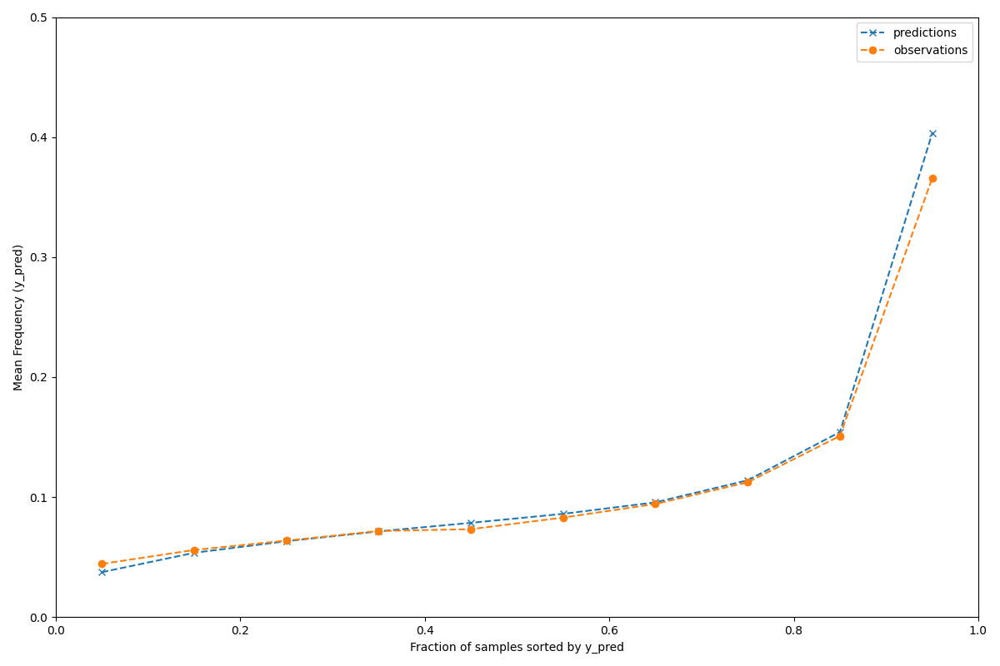

# Configuring SageMaker Training Jobs with Hydra

[](https://opensource.org/licenses/MIT-0)

# Introduction
A typical machine learning (ML) workflow is to first develop and test solutions on a local machine, then run large scale experiments (e.g. with different parameters) in the cloud, and ultimately deploy them there. Without a unified approach to this setup, developers typically have to refactor their code at each step. If the solution depends on a large number of parameters that might change at any step of this process, it can become even harder to keep everything organized and consistent.
This artifacts addresses these challenges. It provides a unified approach configuring and running machine learning algorithms from local testing to production on SageMaker. Here we apply it to training ML algorithms, but the concept is straightforwardly extended to feature engineering, inference and whole ML pipelines.

## Key Features
### Better Configuration with Hydra

[Hydra](https://hydra.cc/) helps manage configuration effectively. With Hydra, you can:

- **Divide Configurations:** Break your project configurations into smaller, manageable pieces that can be independently modified. This makes it easier to handle complex projects.
- **Adjust Defaults Easily:** Quickly change your baseline cofnigurations, making it simpler to test new ideas.
- **CLI and Config Harmony:** Combine command line inputs with your configuration files smoothly. This approach reduces clutter and confusion, making your project more manageable over time.

### Consistent Across Environments

With this artifact developers can use the same workflow, irrespective of whether they are working locally, conducting large experiments on SageMaker, or deploying in production on SageMaker. This consistency is important because:

- It allows for fast, local experimentation without the need for major adjustments when scaling up.
- Transitioning to larger experiments on SageMaker is seamless, requiring no overhaul of the existing setup.
- Moving to production is just as straightforward, ensuring your project works as expected, regardless of the environment.

It's about making the process more manageable, so developers can focus on the work that matters.

## Sample Use Case
To demonstrate the capabilities of Hydra in combination with Amazon SageMaker, we are using a [Poisson Regression use case](https://scikit-learn.org/stable/auto_examples/linear_model/plot_poisson_regression_non_normal_loss.html#sphx-glr-auto-examples-linear-model-plot-poisson-regression-non-normal-loss-py) as an example.
Poisson regression is used for analyzing count data, where the outcome variable represents the number of occurrences of a particular event within a fixed unit of observation.
In the sample our goal is to predict the expected frequency of claims following car accidents for a new policyholder given the historical data over a population of policyholders.

The sample uses the freMTPL2freq dataset on OpenML, which comprises information from 677,991 motor third-party liability policies observed over a year. It provides data on risk features and claim numbers, offering insights into the frequency of claims within
the French Motor Third-Party Liability Insurance (MTPL) system. You can access the dataset [here](https://www.openml.org/search?type=data&sort=runs&id=41214&status=active).
It includes features like policyholder demographics (age, gender), vehicle details (make, model), policy specifics (coverage type, premium), geographic data (region) and demographic data (population density).
For further information, either check the dataset on [OpenMl](https://www.openml.org/search?type=data&sort=runs&id=41214&status=active) or [Kaggle](https://www.kaggle.com/datasets/floser/french-motor-claims-datasets-fremtpl2freq).

## Architecture

The following diagram depicts the architecture of the solution. All details are explained in the following sections.


1. The Data Scientist builds and pushes the docker image to the Amazon ECR repository `hydra-sm-artifact`.
2. The Data Scientist either runs the script [start_sagemaker_training_job.py](/scripts/start_sagemaker_training_job.py) or [start_sagemaker_hpo_job.py](/scripts/start_sagemaker_hpo_job.py) which initiates the SageMaker training job. For the regular training job, the adjusted config gets written to the Amazon S3 bucket `hydra-sample-config`. For the HPO job, the default configuration set in the config folder is applied.
3. The SageMaker job pulls the docker image reads the input data from the data bucket and either fetches the config from the config bucket or uses the default config. After the training, the job saves the output data to the Amazon S3 bucket `hydra-sample-data`.

# Setup

In this section we describe how you can setup the sample solution. Note that this also includes instructions to set up the basic AWS resources (e.g. SageMaker role, S3 bucket,...). Setting them up is optional as may wish to use your existing resources. Moreover, the repository uses pre-commits hooks (see `.pre-commit-config.yaml`) to facilitate high code quality. It is also not part of the core solution.

## Requirements

* [AWS CLI](https://docs.aws.amazon.com/cli/latest/userguide/cli-chap-welcome.html) installed and configured
* [Poetry](https://python-poetry.org/) installed
* [Docker](https://www.docker.com/) or [Finch](https://runfinch.com/) installed
* [Python 3.10.x](https://www.python.org/downloads/release/python-31011/)

## Development setup

Create a virtual environment on your local machine by executing

```
poetry install
poetry shell
```

this will install all necessary dependencies and spawn a shell in your virtual environment.

Authenticate your AWS CLI with the account you want to deploy to, e.g. by using

```
export AWS_ACCESS_KEY_ID=...
export AWS_SECRET_ACCESS_KEY=...
export AWS_SESSION_TOKEN=...
```

or following the instructions [here](https://docs.aws.amazon.com/cli/latest/userguide/cli-chap-configure.html).

## AWS Resources

In order to run a training job on SageMaker with Hydra, you need the following resources in your account.

* A [SageMaker Studio Domain](https://docs.aws.amazon.com/sagemaker/latest/dg/gs-studio-onboard.html)
* Two [Amazon S3 buckets](https://docs.aws.amazon.com/s3/), one for input and output data, the other one to store Hydra config files.
* An [Amazon ECR repository](https://docs.aws.amazon.com/AmazonECR/latest/userguide/Repositories.html) named `hydra-sm-artifact`

You can deploy the [CloudFormation template](./infra/hydra-sagemaker-setup.yaml) which provisions the resources named above.

```shell
aws cloudformation deploy --template-file infra/hydra-sagemaker-setup.yaml --stack-name hydra-sagemaker-setup  --capabilities CAPABILITY_NAMED_IAM
```

## Data
Execute the following in order to download the input data from [openml](https://www.openml.org/) to your local machine.

``` shell
python scripts/download_data.py
```

Hydra uses dot notation to specify arguments. data.train_data_path=data/train.csv specifies your local
data path and evaluation.base_dir_path=data the evaluation directory.

### Dockerfile
The docker image is based on the pre-built Amazon SageMaker docker image for Pytorch, in particular `pytorch-training:2.0.0-cpu-py310`.

# Execution
## Run locally
Execute this command to run the training on your local.

``` shell
python mypackage/train.py data.train_data_path=data/train.csv evaluation.base_dir_path=data
```
This will save an evaluation plot of the resulting model in the `data` folder, which is explained in the "Output" section below.
Note that you can also perform multiple trainings in parallel, with different parameters, by using the `--multirun` functionality explained in the [Hydra documentation](https://hydra.cc/docs/tutorials/basic/running_your_app/multi-run/). The logs of all executions are stored by execution time in a folder called `outputs`.

## Run on SageMaker
### Set environment variables
In order to run your job on Amazon SageMaker you need to export the environment variables below.

```shell
export ECR_REPO_NAME=hydra-sm-artifact
export image_tag=latest
export AWS_REGION="<your_aws_region>" # for instance, us-east-1
export ACCOUNT_ID="<your_account_id>"
export BUCKET_NAME_DATA=hydra-sample-data-$ACCOUNT_ID
export BUCKET_NAME_CONFIG=hydra-sample-config-$ACCOUNT_ID
export AWS_DEFAULT_REGION=$AWS_REGION
export ROLE_ARN=arn:aws:iam::${ACCOUNT_ID}:role/hydra-sample-sagemaker
export INPUT_DATA_S3_PATH=s3://$BUCKET_NAME_DATA/hydra-on-sm/input/
export OUTPUT_DATA_S3_PATH=s3://$BUCKET_NAME_DATA/hydra-on-sm/output/
```

### Create docker image and push to registry

Execute the following command to make the bash script executable and create a docker image from
the [dockerfile](Dockerfile) specified. This docker image will get pushed to the ECR repository specified
in the environment variable above and will be used to spin up the SageMaker container in which the training job will run.

```shell
chmod +x scripts/create_and_push_image.sh
scripts/create_and_push_image.sh $ECR_REPO_NAME $image_tag $AWS_REGION $ACCOUNT_ID
```

### Submit SageMaker training jobs
Specify where you want to save the training data in the Amazon S3 bucket for data and move training data there:
```shell
aws s3 cp data/train.csv "${INPUT_DATA_S3_PATH}train.csv"
```

By configuring default parameters in [default.yaml](./mypackage/config/sagemaker/default.yaml), you simplify the execution of your scripts.
This setup not only ensures consistency across runs but also offers the flexibility to easily override default settings as needed. For example:

```shell
python scripts/start_sagemaker_training_job.py sagemaker.role_arn=$ROLE_ARN sagemaker.config_s3_bucket=$BUCKET_NAME_CONFIG sagemaker.input_data_s3_path=$INPUT_DATA_S3_PATH sagemaker.output_data_s3_path=$OUTPUT_DATA_S3_PATH
```
You will be able to see the result on S3 in the `OUTPUT_DATA_S3_PATH`, an evaluation run identical to the one obtained locally (see section "Output").
This approach allows you to quickly adjust your configuration for different scenarios, enhancing both usability and adaptability of your scripts.

Note that in this approach, we save the config file on S3, then pass it to the SageMaker training job through a channel, and drop it into '/opt/ml/input/data/config/config.json' within the training container. The `sagemaker_entrypoint.py` script then picks up the file from there and overwrites the default configurations. This method has the advantage of systematically logging all configurations on S3 and, more importantly, allowing changes to an arbitrary number of hyperparameters simultaneously. Hyperparameters different from the default can also be passed through the `Hyperparameters` argument of the `boto3` call. However, only a limited number of parameters and characters are allowed. Therefore, if the number of changed hyperparameters is either unknown or too large, the approach using the config file is preferable. That said, SageMaker Hyperparameter tuning is necessary, as we will demonstrate in the next section.

Note that you can also perform multiple trainings in parallel, with different parameters, by using the `--multirun` functionality explained in the [Hydra documentation](https://hydra.cc/docs/tutorials/basic/running_your_app/multi-run/). The logs of all executions are stored by execution time in a folder called `outputs`.

### SageMaker hyperparameter tuning

Running hyperparameter tuning is similar to the training jobs discussed before. However, the execution script differs in some important ways as can be seen in [start_sagemaker_hpo_job.py](scripts/start_sagemaker_hpo_job.py). The hyperparameters to be tuned have to be passed through the boto3 payload, not a channel to the training job. To start the HPO job, run

```shell
python scripts/start_sagemaker_hpo_job.py sagemaker.role_arn=$ROLE_ARN sagemaker.config_s3_bucket=$BUCKET_NAME_CONFIG sagemaker.input_data_s3_path=$INPUT_DATA_S3_PATH sagemaker.output_data_s3_path=$OUTPUT_DATA_S3_PATH
```
This will launch a Hyper Parameter Optimization (HPO) job with two underlying training jobs that are trying to find the best value of the `model.max_leaf_nodes` value, given all other parameter stay constant.

```
"ParameterRanges": {
            "IntegerParameterRanges": [
                {
                    "Name": "model.max_leaf_nodes",
                    "MinValue": "10",
                    "MaxValue": "200",
                    "ScalingType": "Auto",
                },
            ]
        }
```
The HPO configurations are defined [default.yaml](mypackage/config/sagemaker/default.yaml).

## Output
If you use the default configuration of this repository, your output will be a plot saved as .png file to your local or S3 output directory.

To ensure reasonable predictions for different policyholder types, we use the test data and bin test samples according to y_pred returned by the Poisson regression model.
Then for each bin, we compare the mean predicted y_pred, with the mean observed target.

The output will look like like the following:



The x-axis represents the "Fraction of samples sorted by y_pred," which essentially shows the cumulative fraction or proportion of the data points sorted by the predicted values (y_pred) from the Poisson regression model.
The x-axis ranges from 0 to 1, representing the full range of sorted fractions.
The y-axis, labeled "Mean Frequency/Value," shows the actual observed values or frequencies (orange line) and the predicted values or frequencies (blue dashed line) from the Poisson regression model.
The close alignment between the observed (orange) and predicted (blue dashed) lines suggests that the Poisson regression model is fitting the observed data reasonably well, as the predicted values closely follow the observed values across the range of sorted fractions.

## Contact

- [David Sauerwein](mailto:dsauerwe@amazon.com)
- [Julian Grueber](mailto:juligrue@amazon.com)
- [Marco Geiger](mailto:marcogei©amazon.ch)

Feel free to reach out if you have any questions or feedback!

# Dependencies and Licenses
This project is licensed under the MIT License - see the [LICENSE](/LICENSE) file for details.

## Hydra

This project uses [Hydra](https://hydra.cc/) as key dependency.

### License information

* License: Mozilla Public License 2.0 (MPL-2.0)
* See [THIRD_PARTY_LICENSES](/THIRD_PARTY_LICENSES) for details.

We adhere to the terms and conditions of the MPL-2.0 license for the Hydra component within our project.
